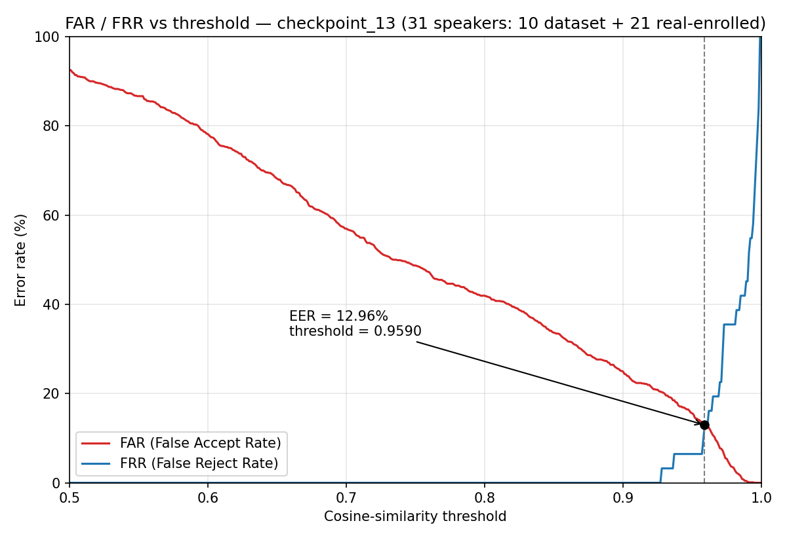
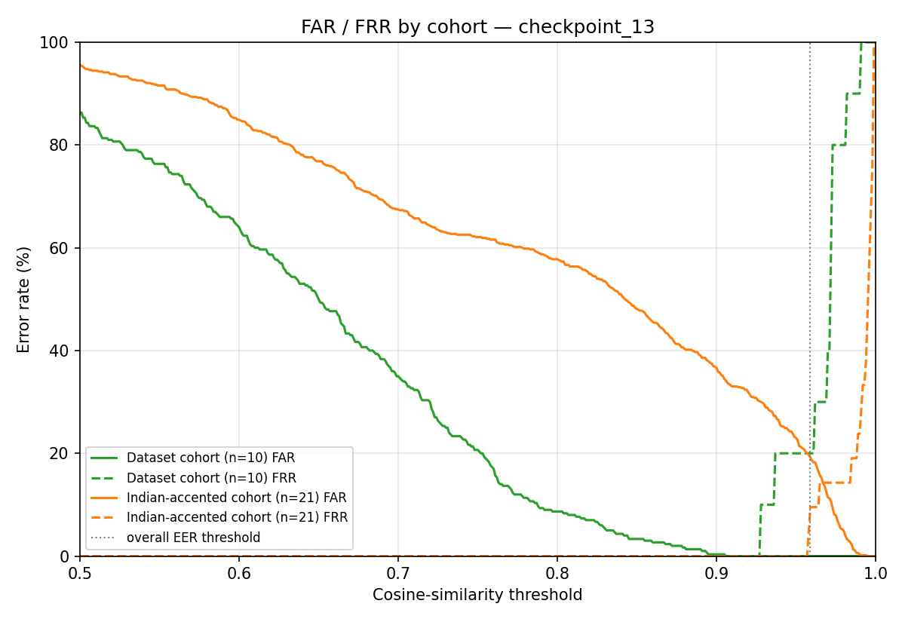

# Speaker Verification & Identification System for Biometric Authentication

A text-independent speaker recognition system that authenticates individuals from their voice.
It extracts a fixed-length "voiceprint" (speaker embedding) from an utterance using a ResNet-based
neural network, then compares embeddings with cosine similarity to **verify** a claimed identity
(1:1) or **identify** a speaker from an enrolled set (1:N).

Journal paper: http://www.ijnrd.org/papers/IJNRD2306536.pdf

## Status

Validated on the bundled test set (see `run_test.py`), using `checkpoint_13` — chosen as the
lowest-EER checkpoint out of 40 evaluated (see `docs/PROJECT_ANALYSIS.md` and `docs/eer_plot.png`):

- **Identification: 10/10 = 100%** on the bundled (anonymized) dataset speakers.
- **Equal error rate (EER):** measured on a larger, accent-diverse 31-speaker set (10 bundled +
  21 additional real speakers, not shipped here — see `docs/PROJECT_ANALYSIS.md`), **EER ≈ 13%**
  at threshold **0.96**. On the bundled 10 speakers alone the error rate looks much better
  (EER ≈ 0.2%) — that number is optimistic and doesn't reflect real-world performance; use the
  31-speaker figure for expectations.
- **Known limitation:** the model reliably accepts genuine speakers even outside its training
  distribution, but is measurably worse at telling *different* out-of-distribution speakers apart
  from each other. See `docs/PROJECT_ANALYSIS.md` — this needs fine-tuning/retraining on
  representative data to fix properly, not just threshold tuning, if your users don't resemble the
  original training population.
- Runs on **GPU** (tested: PyTorch 1.7.1+cu110, NVIDIA RTX 3060) and on **CPU**.

## How it works

```
wav (16 kHz)
  → log-mel filterbank features (40 filters)          # feature_extraction / DB_wav_reader
  → ResNet-18 background network                       # model/model.py (background_resnet)
  → 128-d L2-normalized speaker embedding
  → cosine similarity vs enrolled embedding
  → Accept / Reject   (verification)   or   best-match speaker   (identification)
```

## Quick start

1. Install dependencies (ideally in a fresh conda env or venv):

   ```bash
   pip install -r requirements.txt
   ```
   For GPU, install the CUDA build of torch matching your driver (see notes in `requirements.txt`).

2. Run the end-to-end self-test (auto-detects GPU, falls back to CPU):

   ```bash
   python run_test.py
   ```
   This builds an enrollment gallery from `feat_logfbank_nfilt40/test/<spk>/enroll.p`, scores every
   `test.p`, and prints identification accuracy plus genuine/impostor verification separation.

## Usage

Assumes pre-extracted features laid out as `feat_logfbank_nfilt40/test/<speaker>/{enroll.p,test.p}`
(bundled) and speaker embeddings in `enroll_embeddings/`.

- **Verify** a claimed identity:
  ```bash
  python verification.py      # edit the __main__ block, or call main(enroll_speaker, test_speaker, fname)
  ```
- **Identify** a speaker from the enrolled gallery:
  ```bash
  python identification.py    # edit the __main__ block, or call main(test_speaker, filename)
  ```
- **Train** from scratch: set `TRAIN_FEAT_DIR` in `configure.py`, then `python train.py`.
- **GUI** (optional): `python gui.py` (verify) / `python gui_enroll.py` (enroll).

## Repository layout

| Path | Purpose |
|------|---------|
| `model/` | ResNet-18 background network (`model.py`, `resnet.py`) |
| `model_saved/` | Trained checkpoints (`checkpoint_13.pth` is the validated one — see `docs/PROJECT_ANALYSIS.md`) |
| `enroll_embeddings/` | Precomputed speaker embeddings (the enrolled gallery); only the 10 bundled dataset speakers ship here |
| `feat_logfbank_nfilt40/test/` | Bundled test features per speaker (10 anonymized dataset speakers) |
| `test_wavs/` | Bundled raw test audio (10 anonymized dataset speakers) |
| `configure.py` | Paths and feature-extraction settings |
| `DB_wav_reader.py`, `SR_Dataset.py` | Data loading / feature reading |
| `enroll.py`, `verification.py`, `identification.py` | Core entry points |
| `run_test.py` | Self-contained, path-independent validation harness |
| `docs/` | Project analysis, EER/FAR-FRR plots, known limitations |
| `website/` | Separate Node.js/Express + Firebase web front-end |

## Threshold / EER analysis



Measured on a 31-speaker set (10 bundled + 21 additional real speakers not shipped in this repo).
The per-cohort breakdown below shows why: the model separates the bundled (training-matched)
speakers cleanly, but is noticeably less discriminative for speakers outside its training
distribution — see `docs/PROJECT_ANALYSIS.md` for the full writeup.



## Notes & known issues

- **Use `run_test.py` as the reference smoke test.** It rebuilds the gallery from `enroll.p`, so it is
  self-consistent. `identification.py` instead uses the *precomputed* `enroll_embeddings/*.pth`, which
  can be stale relative to the current checkpoint — regenerate them with `enroll.py` if you retrain
  or swap checkpoints (embeddings from different checkpoints aren't comparable to each other).
- **Verification threshold:** default is `0.96`, set at the measured EER point on a 31-speaker,
  accent-diverse set (see above) — not the ~0.89 you'd get from the bundled 10 speakers alone,
  which understates real-world error. Re-derive for your own enrollment population before
  production use.
- **Accent/domain-mismatch limitation:** this is not just a threshold-tuning issue — see
  `docs/PROJECT_ANALYSIS.md` before deploying for a population that doesn't resemble the original
  training data.
- **GPU memory:** running several inference processes at once (or alongside other GPU apps) can trigger
  transient `CUBLAS_STATUS_NOT_INITIALIZED`. Close other GPU users or run on CPU.
- `train1.py` is an unfinished experimental variant; use `train.py`.

## Credits

Built on the speaker-recognition tutorial by [jymsuper](https://github.com/jymsuper/SpeakerRecognition_tutorial).
